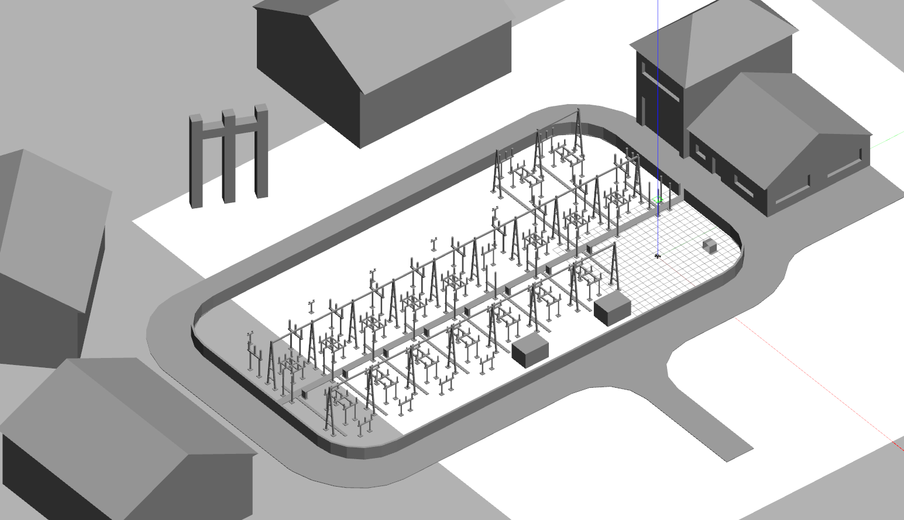

# electrical_substation_world

World and models of an electrical substation packaged for ROS 2 Jazzy and Gazebo Harmonic.



## Features
- SDF 1.7 world (Gazebo Harmonic compatible)
- Models installed and auto-discovered via env hook (no manual GZ_SIM_RESOURCE_PATH export)
- ROS 2 launch file with selectable world and GUI mode
- ros_gz clock bridge support (sim time) if ros_gz_sim is present

## Installation
Clone into your ROS 2 workspace (e.g. ~/ws/src):
```bash
git clone https://github.com/RobotnikAutomation/robotnik_gazebo_worlds/
```
Build and source:
```bash
colcon build --packages-select electrical_substation_world
source install/setup.bash
```

## Launch
Default world:
```bash
ros2 launch electrical_substation_world electrical_substation_world.launch.py
```
Select GUI off (headless):
```bash
ros2 launch electrical_substation_world electrical_substation_world.launch.py gui:=false
```
Specify a world file (installed under share/electrical_substation_world/worlds):
```bash
ros2 launch electrical_substation_world electrical_substation_world.launch.py world:=electrical_substation.world
```

## Models
Each model has:
- updated `model.sdf` (SDF 1.7). `model.config` points to the Harmonic version.

To reference a model from another package use:
```xml
<include>
  <uri>model://station_base</uri>
  <pose>0 0 0 0 0 0</pose>
</include>
```
The env hook adds the models directory to `GZ_SIM_RESOURCE_PATH`.


## Cleaning / Rebuild
```bash
rm -rf build/ install/ log/
colcon build --packages-select electrical_substation_world
source install/setup.bash
```

## License
Apache 2.0 (see LICENSE file).


## Quick Reference
Parameters:
- `world`: world file name (default: electrical_substation.world)
- `gui`: true|false